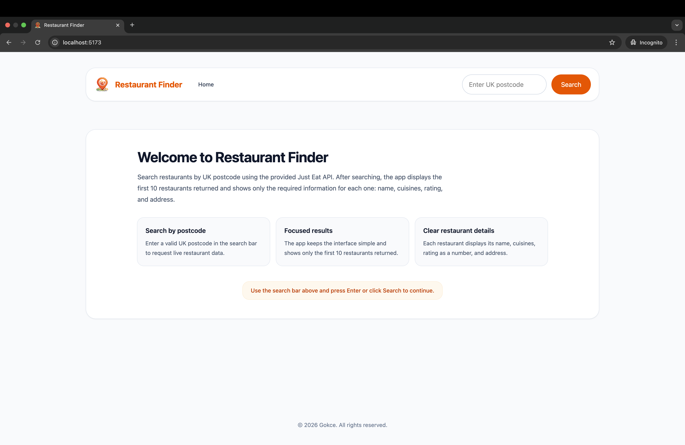
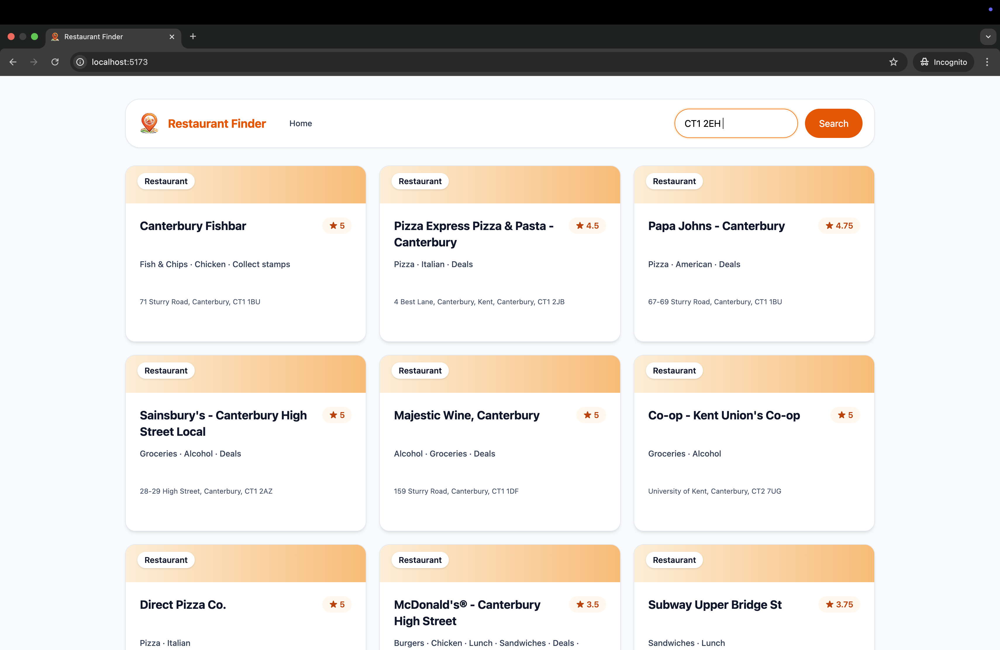
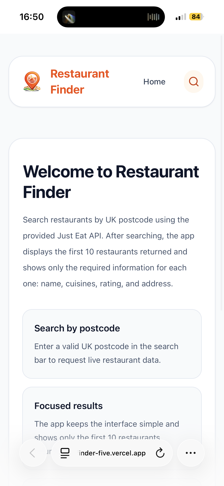
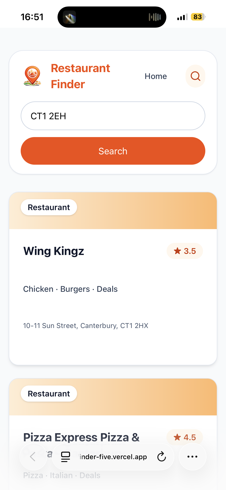

# Restaurant Finder

Live demo deployed on Vercel: [Restaurant Finder](https://jet-restaurant-finder-five.vercel.app)

A React + TypeScript take-home project for Just Eat Takeaway.com.

This application accepts a UK postcode, calls the provided JET API endpoint, and displays restaurant data in a clean interface.

## Assignment Requirements

This project satisfies the required criteria from the assignment brief:

- Uses the provided postcode API:
  - `https://uk.api.just-eat.io/discovery/uk/restaurants/enriched/bypostcode/{postcode}`
- Displays the required restaurant data points:
  - Name
  - Cuisines
  - Rating (as a number)
  - Address
- Limits visible results to the first 10 restaurants
- Includes unit tests for core logic
- Includes build/run/test instructions

## Tech Stack

- **React** for building the user interface
- **TypeScript** for type-safe coding
- **Vite** for development tooling and local build setup
- **Tailwind CSS** for styling
- **Vitest** for unit testing
- **Vercel** for deployment


## Design and Architecture Choices

I chose a small client-side architecture because the assignment is focused on fetching, transforming, and displaying restaurant data rather than building a more complex system. This also keeps deployment simple.

I structured the solution to keep business logic testable and UI components focused on rendering:

- `src/api/restaurantsApi.ts`
  - Handles API communication and postcode normalization before request.
- `src/utils/mapRestaurants.ts`
  - Maps raw API response into a UI-friendly `Restaurant` model.
  - Applies the first-10-restaurants limit required by the assignment.
  - Handles safe fallbacks for missing or incomplete fields.
- `src/hooks/useRestaurantSearch.ts`
  - Coordinates search flow and UI states.
  - Handles user-facing states (welcome, validation, loading, success, no-results, error) in one place.
- Presentational components
  - Focus only on rendering the interface.
  - Display restaurant cards, validation messages, loading skeletons, and result panels.

This separation improves readability and makes the core logic easier to unit test. Moving response mapping and search logic out of the components also made it easier to test data transformation and validation independently from rendering.

## Responsive Design

The interface was designed to be responsive across different screen sizes.

- On larger screens, the layout uses wider content areas and multi-column sections for readability.
- On smaller screens, components stack vertically and spacing adapts to preserve usability.
- The navigation and search flow were also adjusted for mobile so the interface remains easy to use on mobile.


## Trade-offs and Limitations

In my implementation, I prioritized correctness, clarity, and user experience instead of a more complex architecture:

- `useRestaurantSearch` currently handles several responsibilities in one hook to keep the implementation simple. In a larger project, I would split this into smaller hooks or a more structured state management approach.
- Validation and search flow are handled together to make testing easier. In a larger project, I would separate validation logic more clearly from UI state handling.
- Test coverage focuses on core logic (`mapRestaurants` and `validation`) rather than full component/integration testing.
- The first-10 constraint is applied directly in the mapping layer to match the assignment requirements. If pagination or show-more behavior were added later, this would need to become configurable.
- The app uses a Vite proxy in local development to avoid CORS issues. For the Vercel deployment, I needed to add the Vercel rewrite in the `vercel.json` file.


## Data Handling Notes

### Rating as a Number (Mapping Decision)

The API rating object includes both:
- `starRating`
- `count`

The brief asks for “Rating - as a number”, but does not explicitly define how to interpret unrated restaurants.

Decision:
- If `count > 0`, display `starRating` as the numeric rating.
- If `count === 0`, display `N/A` (internally mapped as `null`), to distinguish:
  - a restaurant that has never been rated
  - from a restaurant that has actual rating data

This avoids showing misleading numeric values for unrated restaurants.

## Search Validation and UI State Handling

The search flow handles:

- Empty postcode
- Whitespace-only input
- Invalid postcode format
- Lowercase input
- Input with spaces (e.g. `EC4M 7RF`)

Behavior:
- Invalid input does **not** call the API.
- Valid input continues to fetch normally.
- Validation feedback is shown clearly.

UI states are explicitly separated:

- Welcome panel on first load
- Validation panel for empty/invalid input
- Loading skeleton while fetching
- Fetch error message for the failed requests
- No-results message when API returns no restaurants
- Restaurant list on success

## How to Run Locally

### Prerequisites

- Node.js (LTS recommended)
- npm

### Install

```bash
npm install
```

### Run in Development

```bash
npm run dev
```

Then open the local URL shown in terminal (typically http://localhost:5173).


### Build for Production (used in Vercel deployment)
```bash
npm run build
```
### Run Tests
```bash
npm run test
```

## Assumptions / Unclear Parts

- The assignment asks for rating as a number, but the API provides both `starRating` and `count`. I assumed `count` should be considered when deciding whether a numeric rating is meaningful, so unrated restaurants are shown as `N/A`.
- I assumed postcode input should be normalized before the request so inputs such as lowercase letters or spaces can still be handled correctly.
- I assumed missing or incomplete API fields should be handled in the UI rather than breaking rendering.
- I assumed the first 10 restaurants should be displayed in the same order returned by the API, since the brief does not specify any additional sorting or ranking.
- For testing scope, I prioritized core logic such as mapping and validation rather than full component or integration coverage.

## Challenges & Learnings

- Before this assignment, I had mostly worked with mock APIs.
- This project helped me understand practical CORS and proxy behavior in a real frontend setup.
- During development, I used a Vite proxy at `/api` to avoid browser CORS issues when calling the provided endpoint.
- This improved my understanding of real API integration beyond local mock data.

## Future Improvements

- Color-code rating values
  - `> 4` green
  - `> 3` yellow
  - `> 2` orange
  - otherwise red
- Add sorting
  - by rating
  - by cuisine
- Add filtering
  - by rating
  - by cuisine
- Add search by cuisine
- Show additional restaurant details on cards
- Add Show more / Load more
- Add adjustable result size
- Add restaurant detail page
- Add multi-language support
- Add light/dark theme toggle

## AI Usage Transparency

AI tools were used as support during development, mainly for:
- debugging API fetching issues
- understanding how to handle the local proxy setup for development
- refining UK postcode validation
- UI and styling suggestions for the restaurant cards
- reviewing and simplifying some parts of the code when I got stuck

The overall solution, including the project structure, component breakdown, state flow, edge case handling, data mapping decisions, and implementation choices, was my own work.

I treated AI outputs as suggestions only and reviewed, adapted, and verified them before integrating them into the project.


## Screenshots

### Desktop

<table>
  <tr>
    <td></td>
    <td></td>
  </tr>
</table>

### Mobile

<table>
  <tr>
    <td></td>
    <td></td>
  </tr>
</table>
